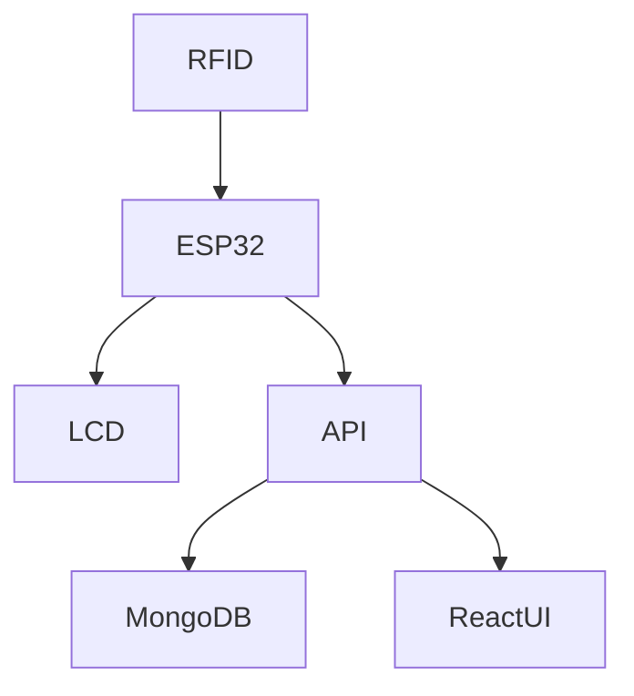

# RFID Based Attendance System

A smart, IoT-based attendance system built using the **MERN stack** for the web interface and **ESP32**, **RFID**, and **16x2 LCD** for the hardware side. This system allows users to scan their RFID card to mark attendance, with real-time updates on the website and LCD display.

## 🔧 Features

- 🔐 RFID authentication via ESP32
- 📅 Date-wise attendance tracking
- 🌐 MERN-based admin/user dashboard
- 📊 Realtime status updates on the web
- 🖥️ 16x2 LCD to display UID & messages
- 📡 ESP32 handles Wi-Fi and API calls
- 🧑‍💻 Admin panel to manage users & records

---

## 🧩 Technologies Used

### Hardware
- **ESP32 Dev Board**
- **RC522 RFID Reader**
- **RFID Tags (13.56MHz)**
- **16x2 LCD Display** (via I2C or parallel)
- **Breadboard & jumper wires**
  
### Software
- **MongoDB** – Database
- **Express.js** – REST API backend
- **React.js** – Frontend UI
- **Node.js** – Server runtime
- **Arduino IDE / PlatformIO** – For ESP32 programming

---

## 🖥️ System Architecture

---

## 🎓 Credits

This project was developed as part of the **Fundamentals of Electrical and Electronics Engineering (FEEE)** course  
📚 **1st Year - 1st Part**

**Contributors:**
- 👨‍💻 Nabaraj Bhandari  
- 👨‍💻 Nikunj Bhusal  
- 👨‍💻 Nirdesh Joshi  
- 👨‍💻 Nabin Gautam  

